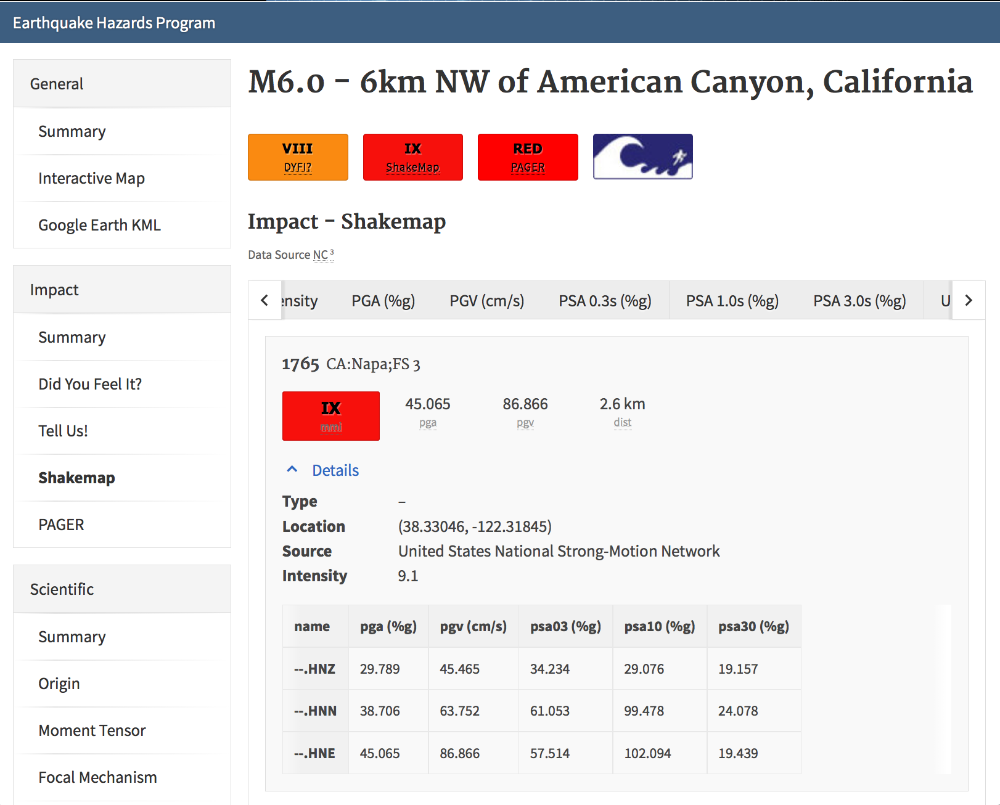

.. _sec_products:

=========================
Products and Formats
=========================
ShakeMap is fundamentally a geographic product, providing a spatial representation of
the potentially very complex shaking field associated with an earthquake. Because of
its complicated nature, we are required to generate numerous maps that portray
various aspects of the shaking that are customized for specific uses or
audiences.  For some uses, it is not the maps themselves but the components that make up
the ShakeMaps that are of interest in order to re-create or further customize the
maps or user-specific products. In this section, we further describe
these ShakeMap component products and the variety of maps and formats.

For each earthquake, all maps and associated products for that event are available
via the “Downloads” link on each earthquake-specific ShakeMap webpage. 

.. _sec_input_files:

Input Files
---------------------
The downloadable products include sufficient information to reproduce the
ShakeMap. In particular, *stationlist.xml* and the *\*_fault.txt* file(s) provide the
input files, *grid.xml* provides the Vs30 grid (see above), and *info.xml*
provides the important configuration and processing parameters, including the
name(s) of the fault file(s).

**Station Lists**. The file *stationlist.xml* contains the combined input data from
all of the original processing center’s input files in a ShakeMap-readable
format. The file may contain seismic station data, intensity data, or a
combination of both. The file also contains an event tag with the earthquake
source specifications. 
See the ShakeMap :ref:`software-guide` for a complete specification of
the ShakeMap-input XML formats.

For reasons of backward compatibility, we also provide *stationlist.txt*. As with
*grid.xyz*, the use of this file is deprecated and it may disappear in a future
release.

**Fault Files**. Fault files are named *<something>_fault.txt* and are listed in
*info.xml*. Zero or more fault files may be present in the ShakeMap input
directory. See the ShakeMap :ref:`software-guide` for a complete specification
of the fault file format. For the purposes of reproducing the ShakeMap for an
earthquake, it is sufficient to copy the specified file(s) into the event’s
input directory.

Output Files and Products
---------------------------------

The available ShakeMap products include (and each is described in more detail in the sections
that follow):

* **Metadata and runtime information**
   * FGDC-compliant metadata 
   * XML file of processing and constraints parameters, input data, output paramaters, timestamps, and versioning.

* **Static maps and plots (images)**
   * Macroseismic Intensity
   * Peak Ground Acceleration (PGA), Peak Ground Velocity (PGV), and Pseudo-Spectral Acceleration (PSA) (when appropriate)
   * Uncertainty maps
   * Regression (GMPE) plots  
   * Station lists
   
* **Interactive maps**

* **Grids of interpolated ground shaking**
   * XML grid of ground motions
   * XML grid of ground motions on “rock”
   * XML grid of ground-motion uncertainty
   * Text grid of ground motions (deprecated)

* **GIS files**
   * GIS Shapefiles
   * `HAZUS-MH® <http://www.fema.gov/hazus/>`_ Shapefiles
   * `ESRI <http://www.esri.com>`_ Raster Grid Files
   * `Google Earth <http://earth.google.com>`_ KML files
   * Contour Files

Metadata and Runtime Information
^^^^^^^^^^^^^^^^^^^^^^^^^^^^^^^^^^^^^^^^^^^^
**Metadata**. FGDC-compliant geospatial metadata files are distributed via the
earthquake-specific ShakeMap webpage for each earthquake under the “Downloads”
page. The metadata are provided in text, HTML, and XML formats in the files
*metadata.txt*, *metadata.html*, and *metadata.xml*, respectively. 

Because the ShakeMap output grid is the fundamental derived product from the ShakeMap
processing, it is fully described in an accompanying metadata file following
Federal Geographic Data Committee (`FGDC <https://www.fgdc.gov/>`_) standards
for geospatial information.  As described below, station amplitudes are provided
in separate ShakeMap station files; however, the complete metadata for the parametric data are
archived by the regional seismic networks and contributing strong-motion data
sources. 

**Supplemental Information**. A second aggregation of important
earthquake-specific ShakeMap information is provided online in the file
*info.xml*. This supplemental information provides a machine-readable (XML)
rundown of many important ShakeMap processing parameters. It includes
information about the data and fault input files; the source mechanism; the
GMPE, IPE, and GMICE selected; the type and source of the site amplifications;
the map boundaries; and important output information, including the bias and
maximum amplitude for each parameter. The *info.xml* is critical for
understanding or replicating any particular ShakeMap.

.. note:: Timestamps, versions of the ShakeMap software employed, event-specific parameters, and the version of the specific ShakeMap run are documented in the supplemental information provided in the *info.xml* file.

Static Maps and Plots (Images)
^^^^^^^^^^^^^^^^^^^^^^^^^^^^^^^^^^^^^^^^^
ShakeMap generates a number of static ground-motion maps and plots for various
parameters (intensity measures, or IMs). Most of these maps are available in
JPEG format, as well as zipped PostScript files that---as vector-based
images---are suitable for PDF conversion or editing. These maps are typically
generated automatically, limiting the format, extent, and features that can be
depicted. Nonetheless, these static maps are ShakeMap’s "signature products" and
serve as maps of record and for other purposes, as described below. Static maps
can be accessed and selected using tabs along the top of the USGS earthquake event
page, as shown in the example in :num:`Figure #napa-event-page`.

.. _napa-event-page:

.. figure:: _static/Napa_Event_Page.png  
   :width: 650px	
   :align: left 

   Event page ShakeMap view for the 2014 M6.0 American Canyon (Napa Valley), CA
   earthquake. The static instrumental intensity map is shown. Tabs above the map allow access and 
   comparison of different intensity measures (IMs), as well as the uncertainty map
   and station list.

**Intensity Maps**. Intensity images---typically of Modified Mercalli Intensity
(MMI), but potentially other intensity measures---are the most familiar ShakeMap
products. The main intensity map consists of a colored overlay of intensity with
the epicenter (and the causative fault, if supplied) prominently marked,
(usually) overlain upon the region’s topography, with other cultural and
geologic features (cities, roads, and active faults) plotted, depending on the
configuration of the ShakeMap system. A detailed scale of intensity is also
provided as described in detail in the :ref:`technical-guide`.

.. note:: **ShakeMap Symbology**. It is a recent ShakeMap convention to depict seismic stations as **triangles** and intensity observations as **circles** (for cities) or **squares** (for geocoded boxes). On intensity maps, symbols are unfilled so that the underlying intensity values are visible. On peak ground motion maps, observations are (optionally) color coded to their amplitude according to the legend shown below each map. The epicenter is indicated with a **star**, and for larger earthquakes, the surface projection of the causative fault is shown with **black lines**.
	  
Strong motion and intensity data symbols default to "see-through” (unfilled) mode for the
intensity map shown in :num:`Figure #napa-shakemap-cover` and are color-filled
for peak ground motion maps (:num:`Figure #napa-pga`). ShakeMap operators may
chose to modify these defaults using alternative mapping configurations.

.. _napa-shakemap-cover:
.. figure:: _static/Napa_ShakeMap_cover.*
   :width: 650px
   :align: left

   Intensity ShakeMap from the 2014 M6.0 American Canyon (Napa Valley), CA earthquake. Strong-motion data
   (triangles) and intensity data (circles) default to "see-through” mode for the intensity map. The
   north-south black line indicates the fault location, and the epicenter is a red star. The intensity
   color-coding either as observed (for macroseismic data) or as converted is derived from the conversion equations of :ref:`Wald et al. \(1999b\)
   <wald1999b>` as shown in the legend. Note: Map Version Number reflects separate offline processing for this Manual.

.. _napa-pga:
.. figure:: _static/Figure_1_2.*
   :scale: 75%
   :align: left

   Peak acceleration ShakeMap from the 2014 M6.0 American Canyon (Napa Valley), CA
   earthquake. Strong-motion data (triangles) and intensity data (circles) are color-coded according to their intensity
   value, either as observed (for macroseismic data) or as converted by
   :ref:`Wald et al. \(1999b\)  <wald1999b>` as shown in the
   legend. The north-south black line indicates the fault location, which nucleated near the epicenter (red star). Note:
   Map Version Number reflects separate offline processing for this Manual.

**Peak Ground Motion Maps.** ShakeMap generates static maps for PGA, PGV, and
Intensity, and optionally, three separate maps for PSA
(at 0.3, 1.0, and 3.0 sec). The PGM maps are distinct from the
intensity maps: shaking values on the former are colored image overlays; the latter are
PGM contours. On PGM maps, stations' fill colors
indicate the ground motion of the station converted to intensity or, optionally,
the identity of the seismic network data source. When the color indicates peak
ground motion, the values are converted to the intensity color scheme via the
selected ground-motion--intensity conversion equation (GMICE), and the
corresponding color scale bar is provided at the bottom of the map (see example
in :num:`Figure #napa-pga`). 

Interactive Maps
^^^^^^^^^^^^^^^^^^^^^^^^^^^^^^^^^^     
Although the static ShakeMaps are useful, many of these products are more suitably
served as interactive maps which can be dynamically scaled (zoomed) and layered upon
with user-selected background and other overlays. The layers are provided via
GeoJSON, KML, GIS, Raster, and other formats. The USGS Earthquake Program Web
pages employ `Leaflet <http://leafletjs.com/>`_, an open-source JavaScript
library that is suitable for mobile-friendly interactive maps (see, for example, 
:num:`Figure #napa-contours`). Many of the
interactive features are geared towards balancing the experience for both
desktop and mobile visitors (:num:`Figure #napa-mobile`). Since
the interactive maps are zoomable, it is convenient to select
individual stations to query station
information and amplitudes (see the example in :num:`Figure #napa-stationpopup`).
The interactive map also allows users to select and show/hide specific layers,
including seismic stations and DYFI geocoded intensity
stations (:num:`Figure #napa-dyfi`). 	  

.. _napa-contours:

.. figure:: _static/Napa_contours_station.png
   :scale: 40%
   :align: left

   Interactive ShakeMap for the 2014 M6.0 American Canyon, CA
   earthquake. Contours indicate intensities; strong motion data (triangles) and intensity data (circles) are
   color-coded according to their intensity value, either as observed (for macroseismic data) or as converted 
   by :ref:`Worden et al. \(2012\) <worden2012>`.

.. _napa-mobile:

.. figure:: _static/Napa_mobile_shakemap.png
   :scale: 45%
   :align: right

   Mobile view of the interactive ShakeMap for the 2014 M6.0 American Canyon, CA
   earthquake. Contours indicate intensities; strong motion data (triangles) are color-coded according to their intensity
   value.
    

.. _napa-stationpopup:

.. figure:: _static/Napa_contours_station_popup.*
   :scale: 40%
   :align: left 

   Interactive ShakeMap for the 2014 M6.0 American Canyon, CA
   earthquake showing station information pop-up. 

	   
.. _napa-dyfi:

.. figure:: _static/Napa_contours-stas-dyfi.png
   :scale: 40%
   :align: left 

   Interactive ShakeMap for the 2014 M6.0 American Canyon, CA
   earthquake. On the interactive map, reported (DYFI) intensities are geocoded and represented with
   **squares** depicting the 1km grid area they occupy. Reported Intensities are color-coded according to their intensity
   value, either as observed or as converted by :ref:`Wald et al. \(1999b\) <wald1999b>`.

The interactive maps may be accessed by clicking on the static ShakeMaps on the
USGS event pages (e.g., http://earthquake.usgs.gov/earthquakes/eventpage/us10003zgz#impact_shakemap).
   
.. note:: Currently, interactive maps only portray contours of intensity. Other contours can be downloaded for users' programs, or overlain with the GIS or KML formats provided with each ShakeMap.

**Uncertainty Maps**. As discussed in detail in the :ref:`technical-guide`,
gridded uncertainty is available for all ground motion parameters. The ratio of 
the ShakeMap PGA uncertainty to the GMPE’s uncertainty is also available (see 
the section on :ref:`sec_interpolation`). 

We utilize the uncertainty ratio to produce a graded map of uncertainty. Where
the ratio is 1.0 (meaning the ShakeMap is purely predictive), the map is colored
white. Where the ratio is greater than 1.0 (meaning that the ShakeMap
uncertainty is high because of unknown fault geometry), the map shades toward
dark red, and where the uncertainty is less than 1.0 (because the presence of
data decreases the uncertainty), the map shades toward dark blue. These maps
provide a quick visual summary of the quality of ground-motion estimates over
the area of interest.

ShakeMaps are also given a letter grade based on the mean uncertainty ratio
within the area of the MMI-VI contour (on the theory that this is the area most
important to accurately represent). A ratio of 1.0 is given a grade of “C”; maps
with mean ratios greater than 1.0 get grades of “D” or “F”; ratios less than 1.0
earn grades of “B” or “A”. If the map does not contain areas of MMI >= VI, no
grade is assigned. See :num:`Figure #napa-urat` for an example uncertainty map.

.. _napa-urat:
.. figure:: _static/Napa_urat_pga.*
   :width: 650px
   :align: left 

   ShakeMap uncertainty maps for the 2014 M6.0 American Canyon, CA
   earthquake. Color-coded legend shows uncertainty ratio, where “1.0”
   indicates 1.0 times the GMPE’s sigma. The average uncertainty is
   computed by averaging uncertainty at grid points that lie
   within the MMI-VI contour (bold contour line). For more details, see
   :ref:`Wald et al. \(2008\) <wald2008>`,
   :ref:`Worden et al. \(2010\)	<worden2010>`, and the :ref:`technical-guide`.
   
**Regression (GMPE and Distance Attenuation) Plots.**

ShakeMap can also (optionally) produce graphs of the observational data plotted with the biased 
and unbiased GMPE. For example, :num:`Figure #northridge-mi-regr-w-dyfi` shows
the 1994 M6.7 Northridge earthquake MMI data, and :num:`Figure #northridge-pga-regr-w-dyfi` shows the
PGA data and GMPE.

.. _northridge-mi-regr-w-dyfi:
.. figure:: _static/northridge_mi_regr_w_dyfi.*
   :width: 650px
   :align: left 

   Plot showing the 1994 M6.7 Northridge, CA earthquake MMI data (seismic stations are yellow triangles; 
   DYFI observations are blue circles) plotted with the unbiased (red line) and biased
   (green line) IPE. The dashed green lines show the biased IPE ±3 standard deviations.

.. _northridge-pga-regr-w-dyfi:
.. figure:: _static/northridge_pga_regr_w_dyfi.*
   :width: 650px
   :align: left 

   Plot showing the 1994 M6.7 Northridge, CA earthquake PGA data (seismic stations are yellow triangles; 
   DYFI observations are blue circles) plotted with the unbiased (red line) and biased
   (green line) GMPE. The dashed green lines show the biased GMPE ±3 standard deviations.

.. _sec_interpolated_grid_file:

Interpolated Ground Motion Grids
^^^^^^^^^^^^^^^^^^^^^^^^^^^^^^^^^^^^^^^^^^^^^^^^^
     
As described in the Technical Manual, the fundamental output product of the
ShakeMap processing system is a finely-sampled grid (nominally 1km
spacing) of latitude and longitude
pairs with associated amplitude values of shaking parameters at each point.
These amplitude values are derived by interpolation of a combination of the
recorded ground shaking observations and estimated amplitudes, with consideration
of site amplification at all interpolated points.  The resulting grid of
amplitude values provides the basis for generating color-coded intensity contour
maps, for further interpolation to infer shaking at selected locations, and for
generating GIS-formatted files for further analyses.

**XML Grid**. The ShakeMap XML grid file is the basis for nearly all ShakeMap
products, as well as for computerized post-processing in systems such as
ShakeCast and PAGER [see :ref:`sec_related-systems`]. The XML grid is available
as both plain text (*grid.xml*) and compressed as a zip file
(*grid.xml.zip*). As XML, the grid is meant to be self-describing; however, we describe the format
here for the sake of completeness.

After the XML header, the first line is the *shakemap_grid* tag:

 ::

   <shakemap_grid xsi:schemaLocation="http://earthquake.usgs.gov
   http://earthquake.usgs.gov/eqcenter/shakemap/xml/schemas/shakemap.xsd" event_id="19940117123055" 
   shakemap_id="19940117123055" shakemap_version="2" code_version="3.5.1446" process_timestamp=
   "2015-10-30T20:38:19Z" shakemap_originator="us" map_status="RELEASED" shakemap_event_type=
   "ACTUAL">
   
Aside from schema information, the *shakemap_grid* tag provides the following attributes:

-  *event_id*: Typically this will a string of numbers and/or letters with or without a network
   ID prefix (e.g., “us100003ywp”), though in the case of major historic earthquakes, scenarios, or
   other special cases it may be a descriptive string, as above (“Northridge”).
-  *shakemap_id*: Currently the same as *event_id*, above.
-  *shakemap_version*: The version of this map, incremented each time a map is revised or reprocessed 
   and transferred.
-  *code_version*: The version of the ShakeMap software used to make the map.
-  *process_timestamp*: The date and time the event was processed.
-  *shakemap_originator*: The network code of the center that produced the map.
-  *map_status*: Currently always the string “RELEASED”, but other strings may be used in the future.
-  *shakemap_event_type*: Either “ACTUAL” (for real earthquakes) or “SCENARIO” (for scenarios).

The next tag describes the earthquake source:

 ::

  <event event_id="Northridge" magnitude="6.7" depth="18" lat="34.213000" lon="-118.535700"
   event_timestamp="1994-01-17T12:30:55GMT" event_network="ci" event_description="Northridge" />

Most of the attributes are self-explanatory:

-  *event_id*: See above.
-  *magnitude*: The earthquake magnitude.
-  *depth*: The depth (in km) of the earthquake hypocenter.
-  *lat/lon*: The latitude and longitude of the earthquake epicenter.
-  *event_timestamp*: The date and time of the earthquake.
-  *event_network*: The authoritative seismic network in which the earthquake occurred.
-  *event_description*: A string containing the earthquake name or a location string (e.g., “13 km SW of Newhall, CA”).

Following the event tag is the grid_specification tag:

 ::

   <grid_specification lon_min="-119.785700" lat_min="33.379666" lon_max="-117.285700" 
   lat_max="35.046334" nominal_lon_spacing="0.008333" nominal_lat_spacing="0.008333" nlon="301"
   nlat="201" />

The attributes are:

-  *lon_min/lon_max*: The boundaries of the grid in longitude.
-  *lat_min/lat_max*: The boundaries of the grid in latitude.
-  *nominal_lon_spacing*: The expected grid interval in longitude within the resolution of the 
   numeric format of the output.
-  *nominal_lat_spacing*: The expected grid interval in latitude within the resolution of the 
   numeric format of the output.
-  *nlon/nlat*:	The number of grid points in longitude and latitude. The grid data table will 
   contain nlon times nlat rows.

Following the *grid_specification* tag will be a set of event-specific uncertainty tags:

 ::

 <event_specific_uncertainty name="pga" value="0.466260" numsta="598" />
 <event_specific_uncertainty name="pgv" value="0.464209" numsta="595" />
 <event_specific_uncertainty name="mi" value="0.624327" numsta="598" />
 <event_specific_uncertainty name="psa03" value="0.436803" numsta="594" />
 <event_specific_uncertainty name="psa10" value="0.534212" numsta="595" />
 <event_specific_uncertainty name="psa30" value="0.577897" numsta="594" />

These tags provide the uncertainty for the ground motion parameters (natural log units 
for all but intensity, which is in linear units) computed as a misfit from the 
biased GMPE (IPE). This is equivalent to the intra-event uncertainty. The number of 
stations contributing to each uncertainty is also provided. If the number of stations 
falls below the minimum required to compute the bias, the uncertainty value will be
set to -1.

These lines are followed by a number of grid_field tags:

 ::

 <grid_field index="1" name="LON" units="dd" />
 <grid_field index="2" name="LAT" units="dd" />
 <grid_field index="3" name="PGA" units="pctg" />
 <grid_field index="4" name="PGV" units="cms" />
 <grid_field index="5" name="MMI" units="intensity" />
 <grid_field index="6" name="PSA03" units="pctg" />
 <grid_field index="7" name="PSA10" units="pctg" />
 <grid_field index="8" name="PSA30" units="pctg" />
 <grid_field index="9" name="STDPGA" units="ln(pctg)" />
 <grid_field index="10" name="URAT" units="" />
 <grid_field index="11" name="SVEL" units="ms" />

Each tag specifies a column in the grid table that follows.

- *index*:  The column number where the specified parameter may be found. The first column is column “1.”
- *name*:   Description of the parameter in the given column.
- *LON*:    Longitude of the grid location (the “site”).
- *LAT*:    Latitude of the site.
- *PGA*:    Peak ground acceleration at the site.
- *PGV*:    Peak ground velocity.
- *MMI*:    Seismic intensity.
- *PSA03*:  0.3 sec pseudo-spectral acceleration.
- *PSA10*:  1.0 sec pseudo-spectral acceleration.
- *PSA30*:  3.0 sec pseudo-spectral acceleration.
- *STDPGA*: The standard error of PGA at the site (in natural log units).
- *URAT*:   The uncertainty ratio. The ratio STDPGA to the nominal standard error of the GMPE at the site (no units).
- *SVEL*:   The 30-meter shear wave velocity (Vs30) at the site.

The measurement units:

- *dd*:   	Decimal degrees.
- *pctg*: 	Percent-g (i.e., nominal Earth gravity).
- *cms*: 	Centimeters per second.
- *intensity*: 	Generally Modified Mercalli Intensity, but potentially other intensity measures.
- *ms*: 	Meters per second.
- *ln(pctg)*:	Natural log of percent-g.
- *ln(cms)*:	Natural log of centimeters per second.

The number of *grid_field* tags will vary: smaller-magnitude earthquakes may not
have the pseudo-spectral acceleration values; scenarios will not have STDPGA or
URAT; and maps that have not been site corrected will not have SVEL.

The *grid_field* tags are followed by the *grid_data* tag, the gridded data, and the closing tags:

 ::

  <grid_data>
  -119.7857 35.0463 4.3 4.21 5.26 5.76 5.76 1.09 0.5 1 800
  -119.7774 35.0463 4.34 4.23 5.27 5.8 5.78 1.1 0.5 1 800
  -119.7690 35.0463 4.37 4.25 5.27 5.84 5.81 1.1 0.5 1 800
  …
  </grid_data>
  </shakemap_grid>

The fast index for the coordinates is longitude, the slow index is latitude.
Dimensions are from upper left to lower right (i.e., from longitude
minimum/latitude maximum to longitude maximum/latitude minimum). The GMT program
*xyz2grd* (coupled with *gmtconvert*) is particularly useful for converting the
*grid.xml* data into a usable grid file.

**Rock Grid XML**. The file *rock_grid.xml.zip* is a zipped XML file containing
the interpolated grid without site amplifications applied. The rock grid has the
same structure as *grid.xml*, but Vs30 values and PGA uncertainty values are not
supplied. :ref:`amplify_ground_motions` in the :ref:`technical-guide`. 

**Uncertainty Grid XML**. The file *uncertainty.xml.zip* is a zipped XML file
containing the standard errors for each of the ground-motion parameters at each
point in the output grid. It has the same structure as *grid.xml*, with the
additional *grid_field* names:

- *STDPGA*:	Standard error of peak ground acceleration.
- *STDPGV*:	Standard error of peak ground velocity.
- *STDMMI*:	Standard error of seismic intensity.
- *STDPSA03*:	Standard error of 0.3 sec pseudo-spectral acceleration.
- *STDPSA10*:	Standard error of 1.0 sec pseudo-spectral acceleration.
- *STDPSA30*:	Standard error of 3.0 sec pseudo-spectral acceleration.

The standard errors are given in natural log units, except for intensity (linear
units). The PSA entries will be available only if the PSA ground motion
parameters were mapped (typically only for earthquakes of M >= 5.0). No
ground motion data or Vs30 values are available in
*uncertainty.xml.zip*; for those, use *grid.xml.zip*.

**Grid XYZ**. *grid.xyz* is a plain-text comma-separated file of gridded ground motions.

.. note:: The use of *grid.xyz* is deprecated. It is difficult to maintain and have it remain backward-compatible. All users are urged to use the XML grids instead, and to switch to the XML grids if they are using *grid.xyz*. *grid.xyz* will disappear in a future ShakeMap release.

Station Lists
^^^^^^^^^^^^^^^^^^^^
As discussed in the section :ref:`sec_input_files`, ShakeMap produces station lists of input data 
in XML and text format. We also produce a version in GeoJSON format, which is available for 
download, and is used by the website to plot the stations on the interactive maps. The station
data is available for viewing online by selecting the “Station List” tab on an event's ShakeMap
page. See :num:`Figure #napa-station-table` for an example.

.. _napa-station-table:

   Station table view from ShakeMap event-specific webpages. Link is at right of tabs above the map (see :num:`Figure #napa-event-page`).

	
GIS Products
^^^^^^^^^^^^^^^^^^^^

The GIS Files (zipped) are a collection of shapefiles of contours of the
ShakeMap model outputs for each shaking metric: MMI, PGA, PGV, and PSA at three
periods (0.3, 1.0, and 3.0 sec).  These vectors should be easily importable into a GIS. The ESRI Raster
Files (also zipped) are a collection of ESRI-formatted binary files.  It should
be relatively easy to convert these to (for example) ArcGIS grids using the
standard tools provided with the software. The contours are useful primarily for
overlaying with other data for visualization purposes.  If you plan to do
analysis, where you need to know the MMI value at particular points, then we
would suggest using the ERSRI raster data (see below).

ShakeMap processing does not occur in a Geographic Information System (GIS), but
we post-process the grid files (described above) into raster and shape files for direct
import into GIS. The file base names in each archive are abbreviations of the
type of ground-motion parameter:

 ::

	*mi*    =  macroseismic intensity (usually, but not necessarily, mmi)
	*pga*   =  peak ground acceleration
	*pgv*   =  peak ground velocity
	*psa03* =  0.3 s pseudo-spectral acceleration
	*psa10* =  1.0 s pseudo-spectral acceleration
	*psa30* =  3.0 s pseudo-spectral acceleration

The sub-sections that follow describe available file and product types.

Shapefiles
~~~~~~~~~~~

GIS shapefiles are comprised of four or five standard associated GIS files:

 :: 

  *.dbf* = A DataBase file with layer attributes
  *.shp* = The file with geographic coordinates
  *.shx* = An index file 
  *.prj* = A file containing projection information 
  *.lyr* = A file containing presentation properties (only available for PGA, PGV, and MMI)

In this application, the shapefiles are contour polygons of the peak
ground-motion amplitudes in ArcView shapefiles. These contour polygons are
actually equal-valued donut-like polygons that sample the contour map at fine
enough intervals to accurately represent the surface function. We generate the
shapefiles independent of a GIS using a shareware package (*shapelib.c*).
Contouring, as well as polygon formation and nesting, is performed by a program
written in the *C* programming language by Bruce Worden, and is included in the ShakeMap 
software distribution.

**GIS Shapefiles**. Contour polygons for the PGM parameters are
available as shapefiles intended for use with any GIS software that can
read ArcView shapefiles.  Note, however, that the peak ground velocity (PGV)
contours are in cm/s, and are therefore **not** suitable for HAZUS input. 

The contour intervals are 0.04g for PGA and the three
PSA parameters, and 2cm/s for PGV. The file also includes MMI
contour polygons in intervals of 0.2 intensity units.  These shapefiles have
the same units as the online ShakeMaps. The archive of files is
compressed in zip format and called *shape.zip*.  The *shape.zip* file is
available for all events, but the spectral values are generally only included
for earthquakes of magnitude 4.0 and larger.

.. _hazus:
   
**HAZUS’99 Shapefiles and HAZUS-MH Geodatabases**. We generate shapefiles that
are designed with contour polygons intervals that are appropriate for use with
the Federal Emergency Management Agency’s (FEMA) `HAZUS-MH®
<http://www.fema.gov/hazus/>`_ software, though they may be imported into any
GIS package that can read ArcView shapefiles. Because HAZUS software requires
PGV in inches/sec, this file is not suitable for all
applications. The contour intervals are 0.04g for PGA and the two PSA 
parameters (HAZUS only uses 0.3 and 1.0 sec periods), and 4
inches/sec for PGV. 

HAZUS’99 users can use the *hazus.zip* shapefiles (see below) directly.  However,
the 2004 release of HAZUS-MH uses geodatabases, not shapefiles.  As of this
writing, FEMA has a temporary fix in the form of Visual Basic script that
imports ShakeMap shape files and exports geodatabases.  FEMA has plans to
incorporate such a tool directly into HAZUS-MH in the next official release (D.
Baush, FEMA, Region VIII, oral commun., 2015).

HAZUS traditionally used the epicenter and magnitude of an earthquake as
reported, and used empirical relationships to estimate ground motions over the
affected area.  These simplified ground-motion estimates would drive the computation of
losses to structures and infrastructure, estimates of casualties and displaced
households (for more details, see :ref:`NIBS, 1997 <nibs1997>`).  With the
improvements to seismic systems nationally, particularly in digital
strong-motion data acquisition, and the advent of ShakeMap, HAZUS can now 
directly import a much more accurate description of ground shaking.  The
improved accuracy of the input to loss-estimation routines can dramatically
reduce the uncertainty in loss estimation due to poorly constrained shaking
approximations.  

The HAZUS GIS files are only generated for events that are larger than
(typically) magnitude 4.5.  The set of shapefiles for these parameters is an
archive of files compressed in
zip format (*hazus.zip*) to facilitate file transfer.

.. note:: An important note on the values of the parameters in the HAZUS shape files is that they are empirically corrected from the standard ShakeMap **peak ground motion values** to approximate the **geometric mean** values used for HAZUS loss estimation.  HAZUS was calibrated to work with mean ground motion values (FEMA, 1997). Peak amplitudes are corrected by scaling values down by 15 percent (Campbell, 1997; Joyner, oral commun., 2000). As of this writing, FEMA is considering switching to peak ground motions as presented by ShakeMap rather than employing the geometric mean component. 

ESRI Raster Files (*.fit* files)
~~~~~~~~~~~~~~~~~~~~~~~~~~~~~~~~~~~

ESRI raster grids of the ground-motion
parameters and their uncertainties are also available. The files are found in a
zipped archive called *raster.zip*. Each archive contains four files per
parameter: *<param>.fit* and *<param>.hdr*, which contain the ground-motion
data, and *<param>_std.fit* and *<param>_std.hdr*, which contain the
uncertainties for the ground motions. See *grid.xml* for information on units.
As with the other GIS files, PGA, PGV, and MMI are available for all events,
while the PSA parameters are usually only included for earthquakes
M4.5 and larger.

.. sidebar:: Loading ESRI Raster Grid ShakeMaps into ArcGIS

    1) Open the ArcToolbox in ArcMap
    2) Select Multidimension Tools -> Make NetCDF Raster Layer
    3) In the dialog that appears, select the input *.grd* file you downloaded and unzipped, and name the layer    appropriately ("vs30", etc.)
    4) The new layer should appear in your list of layers.
    5) Note: This layer is ephemeral---if you want to keep the raster version of the data, you'll have to save the layer to a file.

Google Earth Overlay
~~~~~~~~~~~~~~~~~~~~~~~~~

The file *<event_id>.kmz* enables the user to view the
ShakeMap in Google Earth (or other KML-compliant applications). A
color-scaled intensity overlay is provided along with a complete station list,
contours and polygons of intensity and peak ground motion, a fault representation (if
provided), epicenter indicator, intensity scale, and the USGS logo. The
transparency of the intensity overlay is adjustable by the user, as is the
appearance of seismic stations. The KMZ file embeds several 
other files that may be found in the event’s download directory:

 :: 

   epicenter.kmz
   fault.kmz
   overlay.kmz (links to ii_overlay.png)
   stations.kmz
   contours.kmz

Note that the KMZ file is static and will not automatically update when we update the ShakeMap
for an event, so periodic checks for updated maps and reloading of the KMZ is
recommended.

In addition to the ShakeMap-produced KMZ file, the USGS produces a KML file
(linked near the top of the page in the event-centric pages with the title
“Google Earth KML”) which contains not only ShakeMap data, but also data from
PAGER, DYFI, and other sources. This file should be the preferred
source, as it will have the most-up-to-date links, though it does not have all of
the layers available in the ShakeMap KMZ file.

Contour Files
~~~~~~~~~~~~~~~~~~~

As mentioned above in the ShakeMap Output GIS format section,
contour files are available for general GIS, HAZUS, and KML formats. We also
provide GeoJSON format contours, all under the ShakeMap event-specific
"Downloads" tab. 

Real-Time Product Distribution, Automatic Access, and Feeds
---------------------------------------------------------------------------
ShakeMap products are distributed by a number of means immediately after they
are produced. The intent of these products is to help responders and
other responsible parties effectively manage their post-earthquake
activities, so we make it as easy as possible for users with a variety of
technological sophistication and infrastructure to access them. The general 
distribution methods are
interactive Web downloads, RSS feeds, GeoJSON feeds, ShakeCast, the Product
Distribution Layer (PDL) client, and GIS web mapping services. 

Interactive Web Downloads
^^^^^^^^^^^^^^^^^^^^^^^^^^^^^^^^^^^^^^
The easiest way to obtain ShakeMap products immediately following an earthquake
is from the `ShakeMap <http://earthquake.usgs.gov/earthquakes/shakemap/>`_ or
`USGS Earthquake Program <http://earthquake.usgs.gov/>`_ webpages. The event
page for any given earthquake has a download link where all of the products for
that event may be found. The ShakeMap page for an event also has a download link
that lists just the ShakeMap products. The variety
of formats for ShakeMap are described in the previous section.

RSS Feeds
^^^^^^^^^^^^^^^^^^^^^^^^^^^^^^^^^^^^^^
USGS Earthquake Program earthquake information `Feeds
<http://earthquake.usgs.gov/earthquakes/feed/v1.0/>`_ currently include Really
Simple Syndication (RSS) feeds. However, the RSS feeds are deprecated; they will be
decommissioned in 2016. 

GeoJSON Feeds
^^^^^^^^^^^^^^^^^^^^^^^^
**Automatically Retrieving Earthquake Data and ShakeMap Files**. The USGS
Earthquake Program GeoJSON feed provides USGS ShakeMap, along with most other USGS
real-time earthquake products. `GeoJSON <http://geojson.org/>`_ is an extension
of the JavaScript Object Notation (JSON) standard and allows for a
variety of geospatial data structures.  There are JSON parsers in most modern
languages, including Python, Perl, Matlab, and R.

In order to automatically ingest the above data, use the automated 
`GeoJSON feeds <http://earthquake.usgs.gov/earthquakes/feed/v1.0/geojson.php>`_. 
Mike Hearne (USGS), provides `an example python script
<https://gist.github.com/mhearne-usgs/6b040c0b423b7d03f4b9>`_ for querying the USGS
Magnitude 2.5+ thirty-day GeoJSON feed, and downloading the most recent version of
the event products desired by the user. In addition, the USGS Haz-Dev group provides
`other scripts <https://github.com/usgs/devcorner>`_ in various programming languages 
that allow access to the GeoJSON feeds. Modifications to these scripts allow
access to any ShakeMap (or other) products automatically, GIS flavors included.    

**Example**. *How can I use your API to get ShakeMap files download for specific events (that shook Guatemala)?*
	     
The following GeoJSON summary query includes events between 2015-01-01
and 2016-01-01 in the bounding box lat. 10 to 20, long. -95 to -85,
in case an event outside Guatemala results in shaking inside
Guatemala; and includes a ShakeMap product:  

 ::

    http://earthquake.usgs.gov/fdsnws/event/1/query?format=geojson&starttime=2015-01-01T00:00:00
    &maxlatitude=20&minlatitude=10&maxlongitude=-85&minlongitude=-95&endtime=2016-01-01T00:00:00&
    producttype=shakemap

The results include an array of features with summary information for
each event.  The *detail* property is a URL for the GeoJSON detail
feed that includes URLs for ShakeMap files. For example, for the
*us100044xh* event, the GeoJSON detailed feed URL is:

 ::

    HTTP://earthquake.usgs.gov/fdsnws/event/1/query?eventid=us100044xh&format=geojson

The URLs for the ShakeMap files can be found inside the feed:

 ::
    
   FEED.properties.products.shakemap[0].contents['download/grid.xml.zip'].url
   FEED.properties.products.shakemap[0].contents['download/shape.zip'].url

In this case, these are the specific URLs are for the *grid.xml* file
and for the *shape.zip* files, respectively:  

 ::

   http://earthquake.usgs.gov/archive/product/shakemap/us100044xh/us/1450404175265/
   download/grid.xml.zip
   http://earthquake.usgs.gov/archive/product/shakemap/us100044xh/us/1450404175265/
    download/shape.zip

Additional Feeds
^^^^^^^^^^^^^^^^^^^^^
More information about USGS earthquake data feeds is available at our `Feeds & 
Notifications page <http://earthquake.usgs.gov/earthquakes/feed/v1.0/index.php>`_.

ShakeCast System
^^^^^^^^^^^^^^^^^^^^^^^^
ShakeCast delivers user-specified ShakeMap products to the user’s
local or virtual system(s), and runs fragility-based damage (or
inspection priority) calculations for specific portfolios. More advanced
features of ShakeCast include a complete suite of damage
estimation and mapping tools, coupled with sophisticated tools to notify
responsible parties within an organization on a per-facility basis. See
:ref:`sec_related-systems` for more details. Complete background on ShakeCast
can be found on the ShakeCast `homepage
<http://earthquake.usgs.gov/research/software/shakecast/>`_ and `Wiki
<https://my.usgs.gov/confluence/display/ShakeCast/Home>`_ and the documentation provided therein. 

Product Delivery Layer (PDL) Client
^^^^^^^^^^^^^^^^^^^^^^^^^^^^^^^^^^^^^^^^^^^^^^^^
Finally, for academic and government users, ShakeMap products (and other
earthquake products) are communicated through the USGS’s `Product Distribution
Layer (PDL) <http://earthquake.usgs.gov/research/software/#PDL>`_. 

.. _gis_services:

Web Mapping (GIS) Services 
^^^^^^^^^^^^^^^^^^^^^^^^^^^^^^^^^^^^
In addition to the downloadable GIS-formatted ShakeMaps (including shapefiles) that are
readily available for each ShakeMap event, USGS also hosts a real-time `30-day
*Signficant* `Earthquake GIS ShakeMap Feed
<http://geohazards.usgs.gov/arcgis/rest/services/ShakeMap/ShakeMap/MapServer>`_.
`ESRI`_ provides a separate `Disaster Response ArcGIS service
<http://www.esri.com/>`_, providing `live feeds
<https://tmservices1.esri.com/arcgis/rest/services/LiveFeeds/USGS_Seismic_Data/MapServer>`_
to several USGS post-earthquake products. 

.. sidebar:: Related GIS Service Interactions

   Users can access the ShakeMap data behind the GIS service in a variety of ways via the ArcGIS Server “REST API”. Some examples of commonly used data-access options are detailed below.

- `Export Map Image <http://resources.arcgis.com/en/help/rest/apiref/export.html>`_: Download a static image of the map to include in their work.
- `Identify <http://resources.arcgis.com/en/help/rest/apiref/identify.html>`_: Retrieve service data for given geographic location. (Point, Line, Polygon or Envelop)
- `Find <http://resources.arcgis.com/en/help/rest/apiref/find.html>`_: Query service data that contains certain attributes. (ex. ShakeMap data for distinct event id)  
- `Query <http://resources.arcgis.com/en/help/rest/apiref/query.html>`_: Query a specific layer in a service and return a detailed featureset. 

Along with the common GIS service interactions listed above, there are many
other calls that GIS developers can make through the `REST API
<http://resources.arcgis.com/en/help/rest/apiref/>`_.

.. note:: **Earthquake Significance**. The NEIC associates a `*significance* <https://github.com/usgs/earthquake-event-ws/blob/master/src/lib/sql/fdsnws/getEventSummary.sql#L157>`_ number with each earthquake event. Larger numbers indicate more significance. This value is determined by a number of factors, including magnitude, maximum MMI, felt reports, and estimated impact.  The significance number ranges from 0 to 1000.  The "30 day significant earthquake feed" that determines which events are included in the ShakeMap GIS feed uses events with a significance of 600 and greater.  

**Accessing ShakeMap GIS Files:** While this GIS service only provides access to
significant earthquakes that have occurred within the last thirty days, users can
download GIS files for `significant events
<https://tmservices1.esri.com/arcgis/rest/services/LiveFeeds/USGS_Seismic_Data/MapServer>`_
on our website after the thirty-day period.  The significant earthquake archive has
a list of large events with links to each event’s webpage.  From the event
page, users can click on the ShakeMap tab and navigate to the “Downloads”
section to get a zipped bundle of shapefiles.

**Acknowledgement**: USGS appreciates guidance from the Esri Aggregated Live Feed
team, specifically Derrick Burke and Paul Dodd.  Their willingness to share
best practices for robust real-time sharing of GIS data enabled this project to
be completed.
