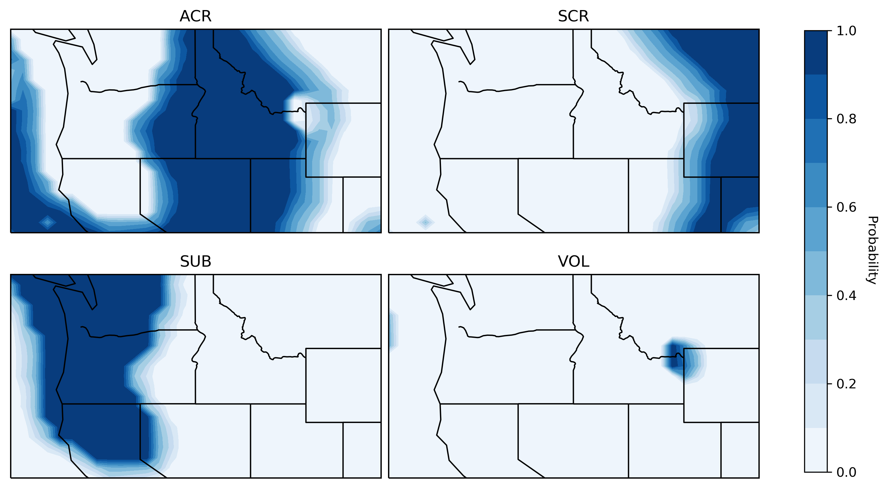

.. _sec-select-4:

******************************
Ground Motion Model Selection
******************************

Overview
========

Tectonic classification of earthquakes is a key component of the USGS
Global ShakeMap system because it serves as the basis for the selection
of ground motion prediction equations (GMPEs). GMPE selection has a
significant impact on the estimated ground motion intensities. The revised
ground motion selection algorithm provides a probability that the earthquake
occurred all possible seismotectonic classifications. These classifications
are configured to be associated with an appropriate GMPE (or weighted set of
GMPEs) and the GMPEs associated with each classification are then combined
based on the probability associated with each classification.

Tectonic Regions
================

:num:`Figure #select-regions` shows a global map of the first layer of
information, which is a set of four mutually exclusive and globally exhaustive
classes, which we refer to as **tectonic regions**: active crustal region (ACR),
stable continental region (SCR), subduction, and volcanic. 

.. _select-regions:

.. figure:: _static/select_regions.png
   :width: 700
   :align: left

   Map of main tectonic regions.

These regions are a simplification of the seismotectonic domains developed by
:ref:`Garcia and others (2012)<garcia2012b>`. The approximate mapping between
the new tectonic regions and the seismotectonic domains is:

+-----------------+---------------+-----------------------------------+ 
| Tectonic Region | Subtypes      | Seismotectonic domains            | 
+=================+===============+===================================+ 
| Active crustal  | Extensional,  | ACR (deep)                        | 
+ region (ACR)    + Compressional +-----------------------------------+
|                 |               | ACR (shallow)                     |
+                 +               +-----------------------------------+
|                 |               | ACR (oceanic boundary)            |
+-----------------+---------------+-----------------------------------+
| Stable          | Marginal,     | ACR (oceanic boundary)            |
+ continental     + Not marginal  +-----------------------------------+
| region (SCR)    |               | SOR (generic)                     |
+-----------------+---------------+-----------------------------------+
| Subduction      | Crustal,      | ACR deep (above slab)             | 
+ (SUB)           + Interface,    +-----------------------------------+
|                 | Intraslab     | ACR oceanic boundary (above slab) | 
+                 +               +-----------------------------------+
|                 |               | ACR shallow (above slab)          | 
+                 +               +-----------------------------------+
|                 |               | SCR (above slab)                  | 
+                 +               +-----------------------------------+
|                 |               | SOR (above slab)                  |
+                 +               +-----------------------------------+
|                 |               | SZ (inland/back-arc)              | 
+                 +               +-----------------------------------+
|                 |               | SZ (on-shore)                     | 
+                 +               +-----------------------------------+
|                 |               | SZ (outer-trench)                 | 
+                 +               +-----------------------------------+
|                 |               | SZ (generic)                      |
+-----------------+---------------+-----------------------------------+
+ Volcanic (VOL)  + --            + ACR (hot spot)                    |
+-----------------+---------------+-----------------------------------+

Note that currently the only subtypes that are made use of are the subduction
zone subtypes. 

There are a number of configuration options for how the tectonic regions are
modeled in `select.conf`. Here is an example of for ACR::

    [tectonic_regions]
        [[acr]]
            horizontal_buffer = 100
            vertical_buffer = 5
            gmpe = active_crustal_nshmp2014, active_crustal_deep
            min_depth = -Inf, 30
            max_depth = 30, Inf
            ipe = VirtualIPE
            gmice = WGRW12
            ccf = LB13

where:

- `horizontal_buffer` - The buffer distance (km) that extends into neighboring
  regions across which the GMPEs are blended. 
- `vertical_buffer` - The buffer distance (km) that blends the depth dependence
  of the GMPEs within this tectonic region.
- `gmpe` - A list of one or more GMPE sets found in gmpe_sets.conf.	    
- `min_depth` - A list of one or more minimum depths (km) corresponding to
  the GMPEs listed under `gmpe`.
- `max_depth` - A list of one or more maximum depths (km) corresponding to
  the GMPEs listed under `gmpe`.
- `ipe` - An intensity prediction module; must be found in the 
  collection of ipe_modules in `modules.conf`.
- `gmice` - A ground motion to intensity module; must be found in the 
  collection of gmice_modules in `modules.conf`.
- `ccf` - A cross-correlation module; must be found in the collection of
  ccf_modules in modules.conf.

:num:`Figure #tectonic-region-example` mapss the probabilities for the main
tectonic regions in the northwest US. This illustrates how the horizontal buffer
smoothly transitions between the regions.

.. _tectonic-region-example:

   Maps of the probability of the four main tectonic regions in the northwest US.
   Top left: active crustal region (ACR); Top right: stable continental region(SCR);
   Bottom left: subduction (SUB); Bottom right: volcanic (VOL).

  
Subduction Subtypes
===================

Within subduction zones, we distribute the probability given to the subduction zone
tectonic region between its three subtypes. This primarily relies on the
`Hayes (2018) Slab2 <https://www.sciencebase.gov/catalog/item/5aa1b00ee4b0b1c392e86467>`_
model.

In the event that an event falls in a subduction zone but the
slab model is not defined, we compute the probability of the interface subtype as
a function of depth and magnitude. The relevant section of `select.conf` is::

    [subduction]
        default_slab_depth = 36.0
        [[p_int_mag]]
            x1 = 7.0
            p1 = 0.0
            x2 = 8.5
            p2 = 1.0
        [[p_int_dep_no_slab_upper]]
            x1 = 17.0
            p1 = 0.0
            x2 = 27.0
            p2 = 1.0
        [[p_int_dep_no_slab_lower]]
            x1 = 45.0
            p1 = 0.0
            x2 = 55.0
            p2 = -1.0

These parameters define taper functions that give more probability to interface
for larger magnitudes, crustal for shallow events, interface for intermediate depth
events, and slab for deeper events, as illustrated in :num:`Figure #sub-no-slab`

.. _sub-no-slab:

.. figure:: _static/sub_no_slab.png
   :width: 700
   :align: left

   Profiles showing the probability of crustal, interface, and interslab subuction
   subtypes (assuming the probability of subduction is 1.0) with depth for a
   magnitude of 7 (left), 8 (center), and 9 (right). 

The slab model is defined for most locations in subduction zones. When available,
we distribute the probability the subtypes with a series of heuristic steps using
the following parameters:

- The distance between the interface in the slab model and the hypocentral depth;
  see the `p_int_hypo` section of `select.conf`.
- The angle of rotation between the plane tangent to the slab at the location
  of the earthquake and the focal mechanism; see the `p_int_kagan` section of
  `select.conf` (the angle is sometimes called the Kagan angle).
- The position of the hypocenter relative to teh maximum depth of the seismogenic
  zone, as given by the slab mode; see the `p_int_sz` section of `select.conf`.
- The position of the hypocenter relative to interface in the slab model; see the
  `p_crust_slab` section of `select.conf`.
- The absolute depth of the hypocenter; see the  `p_crust_hypo` section of
  `select.conf`.

